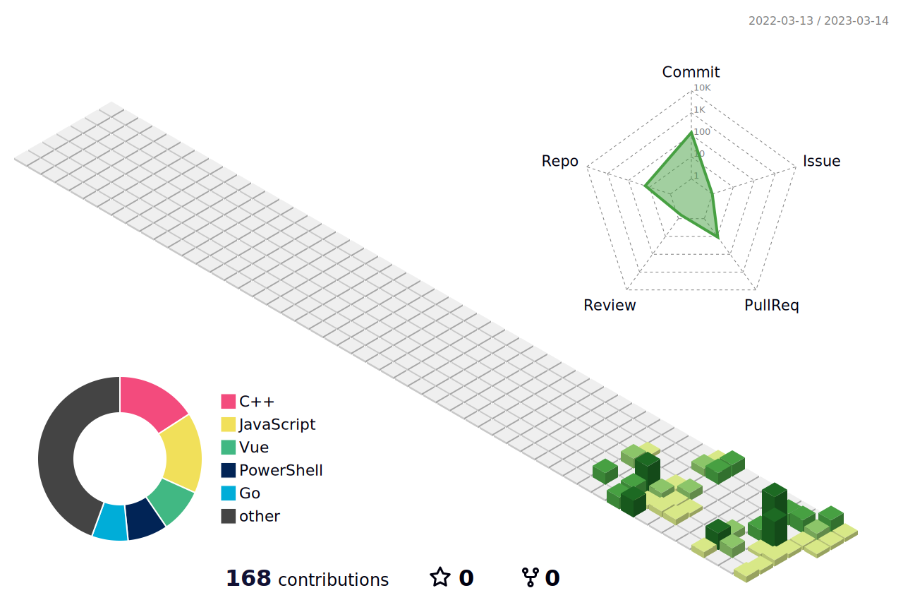

##  I'm Tenifs

- ❤️ I love open source
- 👉Here is my [Github Home Page ](https://github.com/ten1fs)
- 📫 How to reach me: ten1fs@outlook.com

<table width="100%">
  <tr>
    <td></td>
    <td>  </td>
  </tr>
</table>

  

  

  

